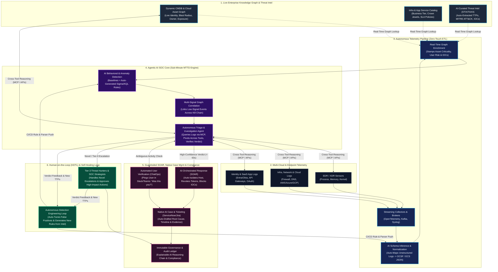

```mermaid
flowchart TB
    %% Styling
    classDef context fill:#1e293b,stroke:#38bdf8,stroke-width:2px,color:#f8fafc
    classDef source fill:#0f172a,stroke:#64748b,stroke-width:1.5px,color:#e2e8f0
    classDef aiPipeline fill:#172554,stroke:#38bdf8,stroke-width:2px,color:#eff6ff
    classDef aiBrain fill:#2e1065,stroke:#c084fc,stroke-width:2.5px,color:#faf5ff
    classDef autoAction fill:#31102f,stroke:#f472b6,stroke-width:2px,color:#fdf2f8
    classDef humanLoop fill:#064e3b,stroke:#34d399,stroke-width:2px,color:#ecfdf5

    %% Layer 1: Live Context & Threat Graph
    subgraph L1 ["1. Live Enterprise Knowledge Graph & Threat Intel"]
        CMDB["Dynamic CMDB & Cloud Asset Graph<br/>(Live Identity, Blast Radius, Owner, Exposure)"]:::context
        Catalog["Infra & App Service Catalog<br/>(Business Tier, Crown Jewels, SLA Policies)"]:::context
        TIP["AI-Curated Threat Intel (STIX/TAXII)<br/>(Auto-Extracted TTPs, MITRE ATT&CK, IOCs)"]:::context
    end

    %% Layer 2: Telemetry Sources
    subgraph L2 ["2. Multi-Cloud & Endpoint Telemetry"]
        EDR["EDR / XDR Sensors<br/>(Process, Memory, Kernel)"]:::source
        InfraLogs["Infra, Network & Cloud Logs<br/>(Firewall, DNS, AWS/Azure/GCP)"]:::source
        AppLogs["Identity & SaaS App Logs<br/>(Entra/Okta, API Gateways, OAuth)"]:::source
    end

    %% Layer 3: AI-Driven Ingestion & Normalization
    subgraph L3 ["3. Autonomous Telemetry Pipeline (Zero-Touch ETL)"]
        Broker["Streaming Collectors & Brokers<br/>(OpenTelemetry, Kafka, Syslog)"]:::aiPipeline
        AutoParse["AI Schema Inference & Normalization<br/>(Auto-Maps Unstructured Logs -> OCSF / ECS JSON)"]:::aiPipeline
        LiveEnrich["Real-Time Graph Enrichment<br/>(Stamps Asset Criticality, User Risk & IOCs)"]:::aiPipeline
    end

    %% Layer 4: Agentic AI Detection & Investigation Core
    subgraph L4 ["4. Agentic AI SOC Core (Sub-Minute MTTD Engine)"]
        AIDetect["AI Behavioral & Anomaly Detection<br/>(Baselines + Auto-Generated Sigma/KQL Rules)"]:::aiBrain
        AICorr["Multi-Signal Graph Correlation<br/>(Links Low-Signal Events Across Kill Chain)"]:::aiBrain
        TriageAgent["Autonomous Triage & Investigation Agent<br/>(Queries Logs via MCP, Pivots Across Tools, Verifies Verdict)"]:::aiBrain
    end

    %% Layer 5: Policy-Guarded SOAR, Case Mgmt & Audit
    subgraph L5 ["5. Guardrailed SOAR, Native Case Mgmt & Compliance"]
        AutoSOAR["AI-Orchestrated Response (SOAR)<br/>(Auto-Isolates Host, Revokes Tokens, Blocks IOCs)"]:::autoAction
        ChatOps["Automated User Verification (ChatOps)<br/>(Pings User in Slack/Teams: 'Was this you?')"]:::autoAction
        AICase["Native AI Case & Ticketing (ServiceNow/Jira)<br/>(Auto-Drafted Root Cause, Timeline & Evidence)"]:::autoAction
        Audit["Immutable Governance & Audit Ledger<br/>(Explainable AI Reasoning Chain & Compliance)"]:::autoAction
    end

    %% Layer 6: Human-on-the-Loop & Continuous Self-Learning
    subgraph L6 ["6. Human-on-the-Loop (HOTL) & Self-Healing Loop"]
        HumanSOC["Tier-3 Threat Hunters & SOC Strategists<br/>(Handles Novel Escalations & Approves High-Impact Actions)"]:::humanLoop
        SelfLearn["Autonomous Detection Engineering Loop<br/>(Auto-Tunes False Positives & Generates New Rules from Intel)"]:::humanLoop
    end

    %% Connections
    EDR & InfraLogs & AppLogs --> Broker
    Broker --> AutoParse --> LiveEnrich
    CMDB & Catalog & TIP -.->|"Real-Time Graph Lookup"| LiveEnrich
    LiveEnrich --> AIDetect --> AICorr --> TriageAgent
    TriageAgent <-->|"Cross-Tool Reasoning (MCP / APIs)"| EDR & InfraLogs & AppLogs & CMDB
    TriageAgent -->|"High-Confidence Verdict (< 60s)"| AutoSOAR
    TriageAgent <-->|"Ambiguous Activity Check"| ChatOps
    AutoSOAR & ChatOps --> AICase --> Audit
    TriageAgent -->|"Novel / Tier-0 Escalation"| HumanSOC
    HumanSOC --> Audit
    HumanSOC & TriageAgent -->|"Verdict Feedback & New TTPs"| SelfLearn
    SelfLearn -->|"CI/CD Rule & Parser Push"| AIDetect & AutoParse
```
