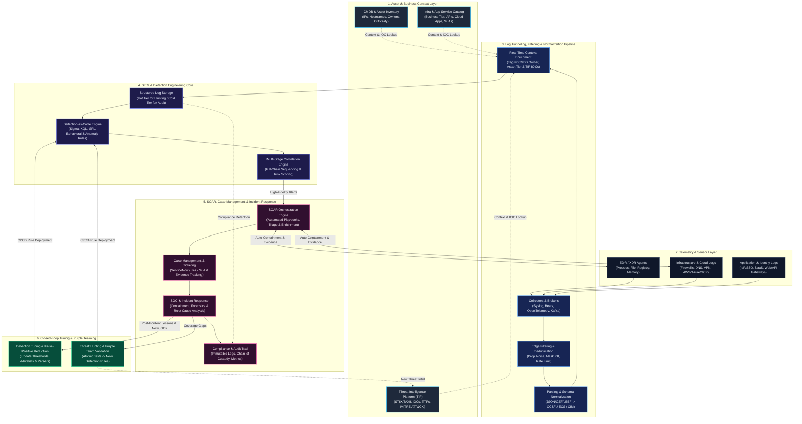

```mermaid
flowchart TB
    %% Styling
    classDef context fill:#1e293b,stroke:#38bdf8,stroke-width:2px,color:#f8fafc
    classDef source fill:#0f172a,stroke:#64748b,stroke-width:1.5px,color:#e2e8f0
    classDef pipeline fill:#172554,stroke:#60a5fa,stroke-width:2px,color:#eff6ff
    classDef siem fill:#1e1b4b,stroke:#818cf8,stroke-width:2px,color:#eef2ff
    classDef soar fill:#31102f,stroke:#f472b6,stroke-width:2px,color:#fdf2f8
    classDef feedback fill:#064e3b,stroke:#34d399,stroke-width:2px,color:#ecfdf5

    %% Layer 1: Asset & Business Context
    subgraph L1 ["1. Asset & Business Context Layer"]
        CMDB["CMDB & Asset Inventory<br/>(IPs, Hostnames, Owners, Criticality)"]:::context
        Catalog["Infra & App Service Catalog<br/>(Business Tier, APIs, Cloud Apps, SLAs)"]:::context
        TIP["Threat Intelligence Platform (TIP)<br/>(STIX/TAXII, IOCs, TTPs, MITRE ATT&CK)"]:::context
    end

    %% Layer 2: Telemetry Sources
    subgraph L2 ["2. Telemetry & Sensor Layer"]
        EDR["EDR / XDR Agents<br/>(Process, File, Registry, Memory)"]:::source
        InfraLogs["Infrastructure & Cloud Logs<br/>(Firewalls, DNS, VPN, AWS/Azure/GCP)"]:::source
        AppLogs["Application & Identity Logs<br/>(IdP/SSO, SaaS, Web/API Gateways)"]:::source
    end

    %% Layer 3: Log Funneling, Filtering & Structuring
    subgraph L3 ["3. Log Funneling, Filtering & Normalization Pipeline"]
        Collector["Collectors & Brokers<br/>(Syslog, Beats, OpenTelemetry, Kafka)"]:::pipeline
        Filter["Edge Filtering & Deduplication<br/>(Drop Noise, Mask PII, Rate Limit)"]:::pipeline
        Parser["Parsing & Schema Normalization<br/>(JSON/CEF/LEEF -> OCSF / ECS / CIM)"]:::pipeline
        Enrich["Real-Time Context Enrichment<br/>(Tag w/ CMDB Owner, Asset Tier & TIP IOCs)"]:::pipeline
    end

    %% Layer 4: SIEM & Detection Engineering
    subgraph L4 ["4. SIEM & Detection Engineering Core"]
        DataLake["Structured Log Storage<br/>(Hot Tier for Hunting / Cold Tier for Audit)"]:::siem
        DetRules["Detection-as-Code Engine<br/>(Sigma, KQL, SPL, Behavioral & Anomaly Rules)"]:::siem
        CorrEngine["Multi-Stage Correlation Engine<br/>(Kill-Chain Sequencing & Risk Scoring)"]:::siem
    end

    %% Layer 5: SOAR, Ticketing & Auditing
    subgraph L5 ["5. SOAR, Case Management & Incident Response"]
        SOAR["SOAR Orchestration Engine<br/>(Automated Playbooks, Triage & Enrichment)"]:::soar
        CaseMgmt["Case Management & Ticketing<br/>(ServiceNow / Jira - SLA & Evidence Tracking)"]:::soar
        IR["SOC & Incident Response<br/>(Containment, Forensics & Root Cause Analysis)"]:::soar
        Audit["Compliance & Audit Trail<br/>(Immutable Logs, Chain of Custody, Metrics)"]:::soar
    end

    %% Layer 6: Continuous Feedback Loop
    subgraph L6 ["6. Closed-Loop Tuning & Purple Teaming"]
        Tuning["Detection Tuning & False-Positive Reduction<br/>(Update Thresholds, Whitelists & Parsers)"]:::feedback
        GapAnalysis["Threat Hunting & Purple Team Validation<br/>(Atomic Tests -> New Detection Rules)"]:::feedback
    end

    %% Flow Connections
    EDR & InfraLogs & AppLogs --> Collector
    Collector --> Filter --> Parser --> Enrich
    CMDB & Catalog & TIP -.->|"Context & IOC Lookup"| Enrich
    Enrich --> DataLake
    DataLake --> DetRules --> CorrEngine
    CorrEngine -->|"High-Fidelity Alerts"| SOAR
    SOAR <-->|"Auto-Containment & Evidence"| EDR & InfraLogs
    SOAR --> CaseMgmt --> IR
    IR --> Audit
    DataLake -.->|"Compliance Retention"| Audit

    %% Feedback Loops
    IR -->|"Post-Incident Lessons & New IOCs"| Tuning
    IR -->|"Coverage Gaps"| GapAnalysis
    Tuning & GapAnalysis -->|"CI/CD Rule Deployment"| DetRules
    GapAnalysis -.->|"New Threat Intel"| TIP
```
